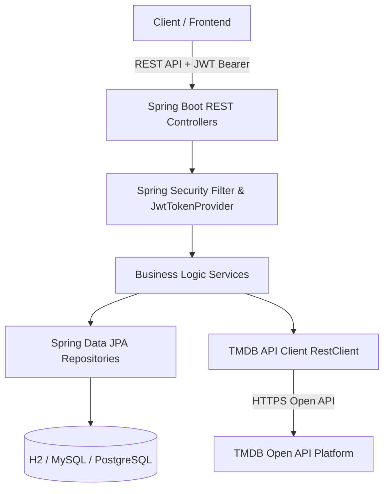
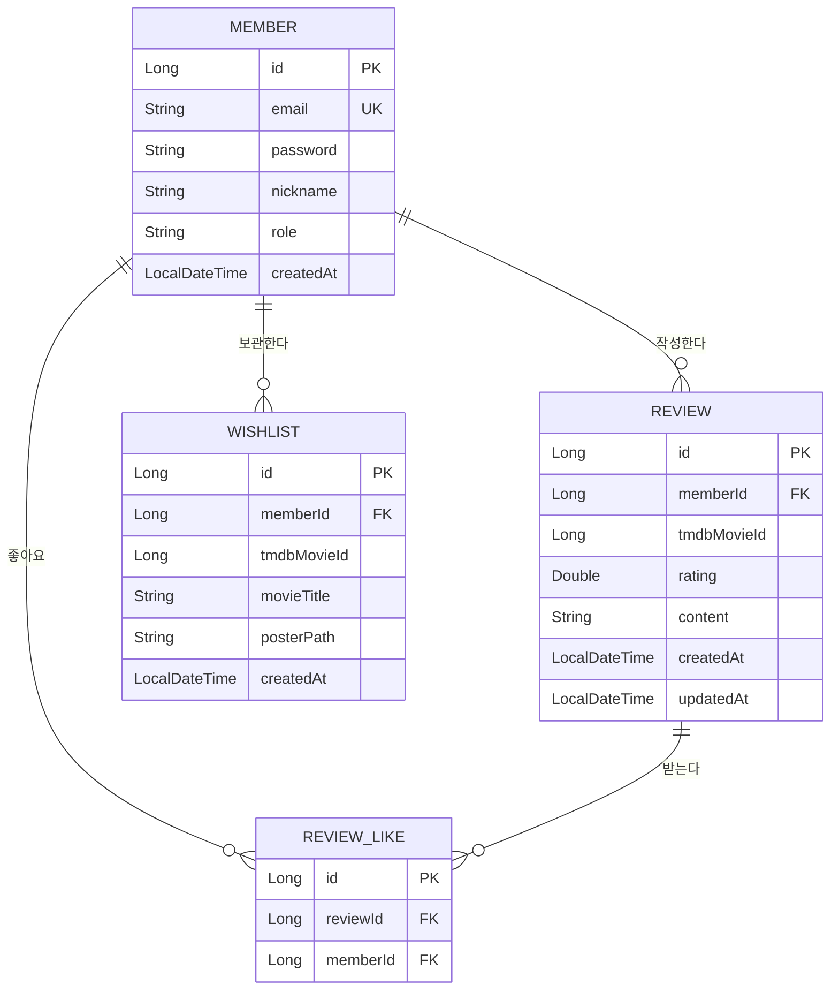

# 🎬 영화 리뷰 & 개인화 추천 서비스 (Movie Project Plan)

Spring Boot와 외부 **TMDB (The Movie Database) API**를 활용한 영화 정보 탐색, 리뷰/별점 관리, 개인화 위시리스트 백엔드 시스템 로드맵입니다.

---

## 🏗️ 1. 아키텍처 및 시스템 구조

---

## 🗄️ 2. 데이터베이스 ERD 설계

---

## 📌 3. 주요 구현 단계 (Roadmap)

### Phase 1: TMDB API 연동 & 영화 탐색 API 🚀
- [x] Spring Boot 기본 설정 및 JPA 구조 완료
- [x] TMDB API Client (`RestClient`) 구축 및 Mock 데이터 셋업
- [x] 인기 영화 목록 (`/api/movies/popular`), 영화 검색 (`/api/movies/search`), 상세 정보 (`/api/movies/{id}`) 구현 완료

### Phase 2: 리뷰 & 별점 시스템 ⭐️
- [x] 영화별 리뷰 작성 (`POST /api/reviews`) 구현 완료
- [x] 영화별 리뷰 목록 조회 (`GET /api/movies/{movieId}/reviews`) 구현 완료
- [x] 영화별 평균 별점 & 리뷰 수 계산 (`GET /api/movies/{movieId}/rating-summary`) 구현 완료
- [x] 리뷰 수정/삭제 API (`PUT`, `DELETE /api/reviews/{id}`) 구현 완료

### Phase 3: 위시리스트 (보고싶은 영화) ❤️
- [x] 위시리스트 추가 (`POST /api/wishlists`) 구현 완료
- [x] 내 위시리스트 목록 조회 (`GET /api/wishlists`) 구현 완료
- [x] 위시리스트 추가 여부 확인 (`GET /api/wishlists/check`) 구현 완료
- [x] 위시리스트 항목 삭제 (`DELETE /api/wishlists`) 구현 완료

### Phase 4: 회원가입 & 로그인 (Spring Security + JWT) 🔐
- [x] Member 엔티티 & BCrypt 비밀번호 암호화 구현 완료
- [x] JWT 토큰 발급 (`JwtTokenProvider`) & 인증 필터 (`JwtAuthenticationFilter`) 구축 완료
- [x] 회원가입/로그인 REST API (`POST /api/auth/signup`, `POST /api/auth/login`) 구현 완료
- [x] React 로그인/회원가입 모달 UI 및 JWT 토큰 헤더 자동 전송 연동 완료
